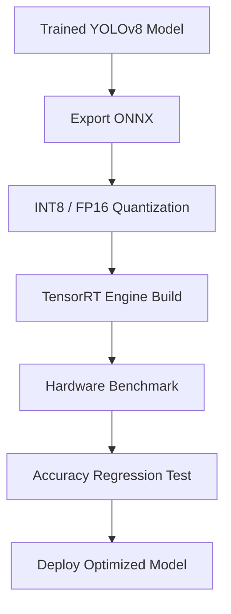
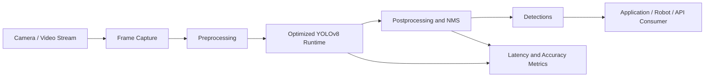

# VisiOln — Custom Object Detection MLOps Pipeline

## Overview

The **YOLOv8 Real-Time Object Detection Framework** is a reusable production-grade object detection pipeline for custom datasets. It supports data annotation, augmentation, training, evaluation, optimization, deployment, and feedback-driven improvement.

The framework achieved approximately 90% detection accuracy on custom datasets and reduced inference time by approximately 45% through model quantization and TensorRT optimization.

<hr>


## Core Capabilities

- End-to-end YOLOv8 object detection lifecycle
- Custom dataset preparation and annotation
- Data augmentation and class balancing
- Model training and evaluation
- Quantization and TensorRT acceleration
- Optimized real-time serving
- Robotics perception transfer
- Reusable MLOps structure for future CV projects

## Technology Stack

| Layer | Technology |
|-------|------------|
| Model | YOLOv8 |
| CV Runtime | OpenCV |
| Training | Python, PyTorch, Ultralytics-style training workflow |
| Optimization | Quantization, TensorRT |
| MLOps | Experiment tracking, model registry, evaluation reports |
| Serving | REST/gRPC inference service, edge runtime |

## End-to-End MLOps Architecture

```mermaid
flowchart LR
    Raw[Raw Images / Videos]
    Label[Annotation Tool]
    Dataset[Versioned Dataset]
    Aug[Augmentation Pipeline]
    Train[YOLOv8 Training]
    Eval[Evaluation and Error Analysis]
    Registry[Model Registry]
    Optimize[Quantization and TensorRT]
    Serve[Inference Service]
    Monitor[Runtime Monitoring]
    Feedback[Feedback Samples]

    Raw --> Label
    Label --> Dataset
    Dataset --> Aug
    Aug --> Train
    Train --> Eval
    Eval --> Registry
    Registry --> Optimize
    Optimize --> Serve
    Serve --> Monitor
    Monitor --> Feedback
    Feedback --> Dataset
```



## Pipeline Stages

### 1. Data Collection

Responsibilities:

- Collect images and videos under diverse lighting and environmental conditions
- Include edge cases such as blur, occlusion, partial objects, and unusual viewpoints
- Maintain class distribution metadata

### 2. Annotation

Responsibilities:

- Label bounding boxes for target objects
- Validate label consistency
- Maintain train, validation, and test splits
- Track annotation quality metrics

Example YOLO format:

```text
<class_id> <x_center> <y_center> <width> <height>
```

### 3. Data Augmentation

Augmentation techniques:

- Random brightness and contrast
- Rotation and scaling
- Mosaic augmentation
- Blur and noise injection
- Horizontal flip where semantically valid
- Cropping and perspective transformation

### 4. Training

Responsibilities:

- Train YOLOv8 models on custom datasets
- Track hyperparameters, metrics, and model artifacts
- Compare model variants by accuracy and latency
- Export best-performing checkpoints

Suggested tracked metrics:

```text
mAP50
mAP50-95
precision
recall
F1 score
inference latency
FPS
model size
false positive rate
false negative rate
```

### 5. Evaluation

Responsibilities:

- Validate model accuracy on held-out data
- Generate confusion matrix
- Analyze failure cases
- Identify class imbalance and annotation errors
- Select deployment candidate based on accuracy-latency tradeoff

### 6. Optimization

Responsibilities:

- Apply quantization
- Export to ONNX or TensorRT runtime
- Benchmark latency on target hardware
- Validate optimized model accuracy against baseline

Optimization flow:



### 7. Serving

Serving options:

| Mode | Use Case |
|------|----------|
| Python batch inference | Offline evaluation and data processing |
| REST API | Web and backend integration |
| gRPC service | High-throughput low-latency inference |
| Edge runtime | Robotics, IoT, and local camera streams |
| ROS2 node | Robotics perception pipeline |

## Runtime Serving Architecture



## Robotics Transfer Design

The framework can be reused for robotics perception by wrapping optimized inference in ROS2 nodes.

Suggested ROS2 topics:

```text
/camera/image_raw
/detector/objects
/detector/debug_image
/detector/inference_stats
```

Example detection message:

```json
{
  "class_name": "object",
  "confidence": 0.93,
  "bbox": [100, 120, 240, 320],
  "timestamp": "2026-01-01T12:00:00Z"
}
```

## Quality Gates

A model should pass the following checks before deployment:

- Accuracy threshold on validation and test datasets
- Latency threshold on target hardware
- No severe class-level regression
- Acceptable false-positive and false-negative profile
- Successful export and optimized runtime validation
- Reproducible training configuration

---
